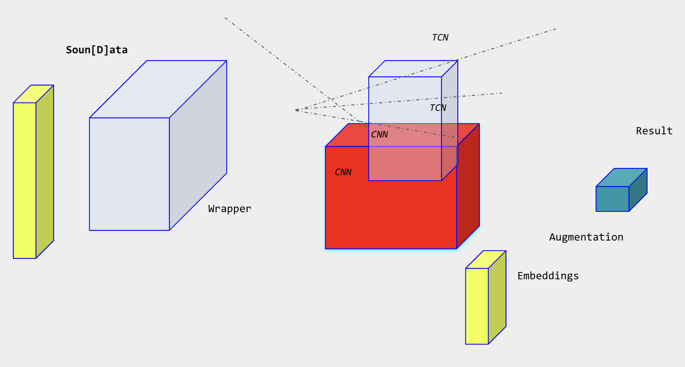
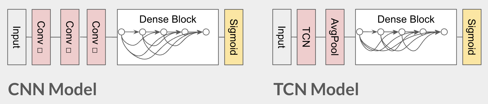

# Noise Bliss: Urban Sound Classification with Deep Learning

A comprehensive framework for environmental audio analysis using the SONYC-UST dataset with state-of-the-art deep learning techniques.

## Project Overview

Noise Bliss is an advanced acoustic scene analysis project focused on urban sound event detection. The system leverages deep learning architectures (CNN and TCN) to classify environmental sounds from the SONYC Urban Sound Tagging (SONYC-UST) dataset. This project represents a complete pipeline for audio processing, feature extraction, model training, and urban noise classification.

  

## Key Components

### 1. Dataset Integration (`wrapper.py`)
Our custom Soundata wrapper enhances SONYC-UST dataset handling:
- `SonycUST` class extending Soundata's base functionality
- Comprehensive methods for annotation loading and audio file access
- Support for SONYC's 8-class coarse-grained taxonomy
- Robust dataset validation and integrity checking

### 2. Audio Processing Pipeline (`utils.py`)
Specialized audio preprocessing utilities:
- Audio loading with standardized sample rate conversion
- Advanced spectrogram generation with consistent dimensionality
- Real-time data augmentation (time shifting, pitch adjustment, noise addition)
- Efficient TensorFlow dataset creation with prefetching
- Visualization tools for spectrograms and model performance metrics

### 3. Model Architecture (`classification.py`)
Multiple neural network architectures optimized for audio classification:
- **CNN Model**: Multi-layer convolutional architecture with batch normalization
- **TCN Model**: Temporal Convolutional Network with dilated causal convolutions
- Custom training functions with multi-label optimization
- Performance metrics tailored to urban sound classification tasks

  

### 4. Training Pipeline (`pipeline.ipynb`)
End-to-end training framework in a structured notebook:
- Dataset validation and exploratory analysis
- Audio feature extraction with visualization
- Model training with hyperparameter optimization
- Detailed performance evaluation and error analysis
- Multi-label classification metrics reporting

## Data Insights
- 62,022 annotations across the SONYC-UST dataset
- 8 coarse-grained sound categories with multi-label assignments
- Comprehensive metadata including geolocation and temporal information
- Standardized train/validation/test splits
- Temporal variation analysis across different times of day

## Implementation Journey
The project evolved through several stages:

1. **Initial Exploration** (`main.ipynb`):
   - Dataset analysis and preliminary feature extraction
   - Basic model prototyping and validation

2. **Model Development** (`models.py`):
   - Early architectural experiments
   - Performance benchmarking across model variants

3. **Optimized Implementation** (`pipeline.ipynb` & `classification.py`):
   - Streamlined data processing workflow
   - Advanced model architectures with improved convergence
   - Comprehensive evaluation framework

## Repository Structure

The project is organized across two main branches:
- **Main Branch**: Primarily used to test wrapper implementation and correct pipeline methodology. Contains the foundational code architecture and validation infrastructure.
- **Train Branch**: Where all in-depth training was performed, containing extensive experimentation logs, hyperparameter tuning results, and optimized models.

## Performance Metrics
Our models achieve competitive results on the SONYC-UST benchmark:
- Multi-label classification with specialized evaluation metrics
- Class-wise performance analysis across urban sound categories
- Robust handling of class imbalance and temporal variations

## Future Work

### Immediate Tasks
1. **Dataset Extension**:
   - Complete the fine-grained label taxonomy support
   - Add cross-dataset evaluation capabilities

2. **Model Improvements**:
   - Optimize architectures with attention mechanisms
   - Implement ensemble methods for improved robustness
   - Add model compression techniques for efficient deployment

3. **Data Processing**:
   - Enhance augmentation strategies for rare sound classes
   - Experiment with additional audio feature representations
   - Implement on-the-fly feature extraction for memory efficiency

### Future Directions
1. **Multi-Label Evaluation**:
   - Advanced metrics for partial matches in sound tagging
   - Confidence calibration for multi-label predictions

2. **Temporal Analysis**:
   - Long-term temporal pattern recognition
   - Time-aware model architectures for context utilization

3. **Deployment**:
   - Efficient inference pipeline for edge computing
   - TFLite conversion with quantization for mobile deployment
   - Real-time processing capabilities for acoustic monitoring

## Usage Instructions
1. Install dependencies: `pip install -r requirements.txt`
2. Download the SONYC-UST dataset to `data/sonyc-ust/`
3. Validate dataset integrity using `pipeline.ipynb`
4. Train models with configuration options in the notebook
5. Evaluate and visualize results with the provided functions

## References
- [SONYC-UST Dataset](https://zenodo.org/record/3966543)
- [Soundata Documentation](https://soundata.readthedocs.io/)
- [Urban Sound Tagging Challenge](https://www.kaggle.com/c/dcase2019-task5/)
- [Deep Learning for Audio Signal Processing](https://ieeexplore.ieee.org/document/8683634)
- [Environmental Sound Classification](https://www.mdpi.com/2076-3417/10/15/5231)